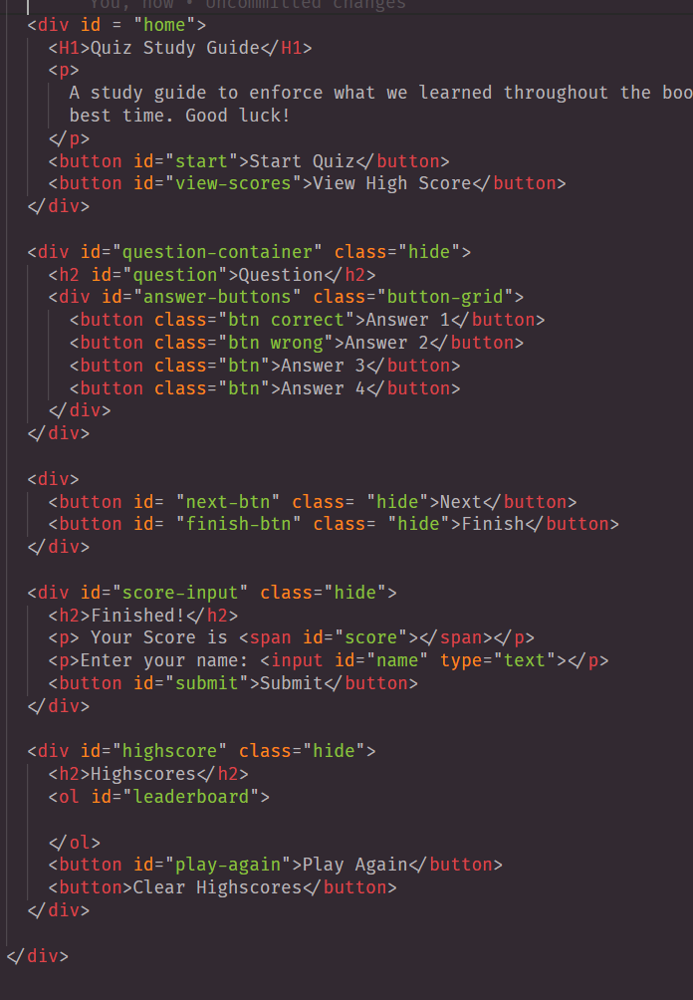
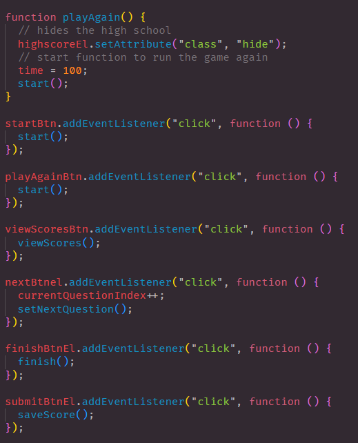
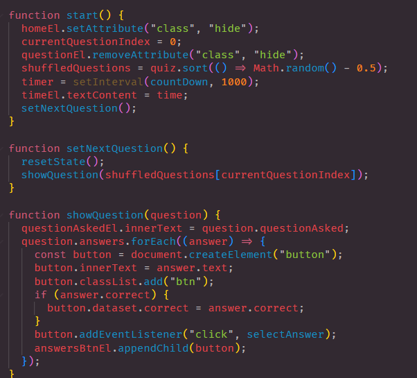

# Quizz-Code

My HTML is broken into a couple of divs. When the app is open, only the starting screen 
div is seen while the rest is hidden. As you progress the quiz game, each button will hide or unhide a div to get to the next screen. 

I made sure to have all the buttons have an event listener to make sure it is interactive
and to run all the functions I have written out. 

These are the functions I've written. All functions are tied to a button that when clicked on, the functions are running correctly. 
